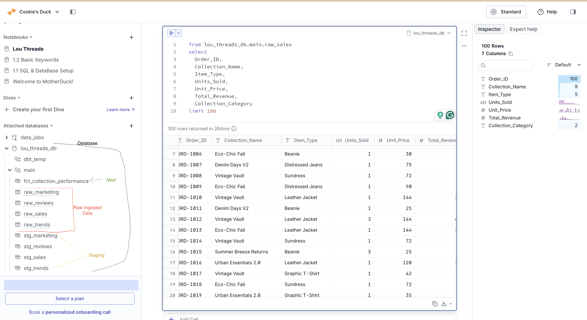
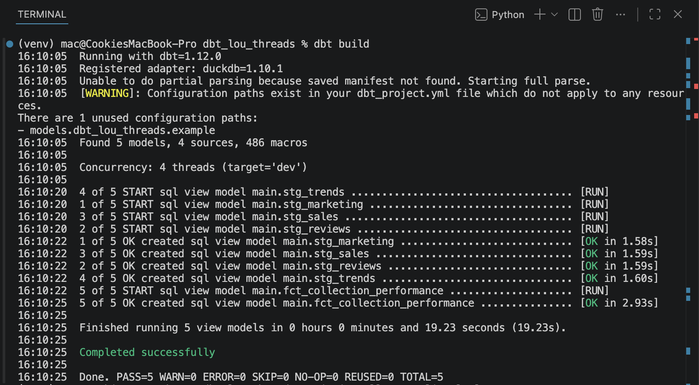
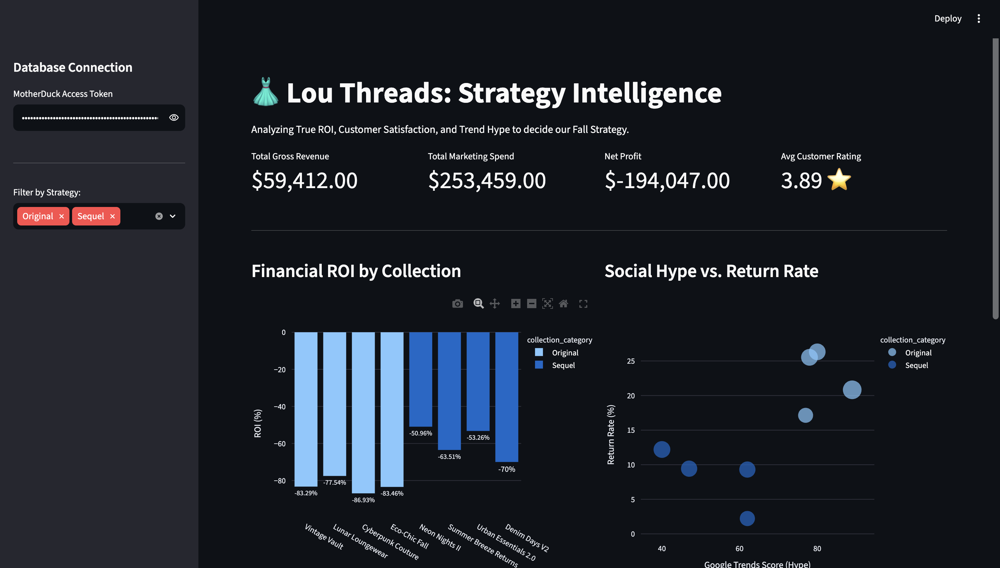
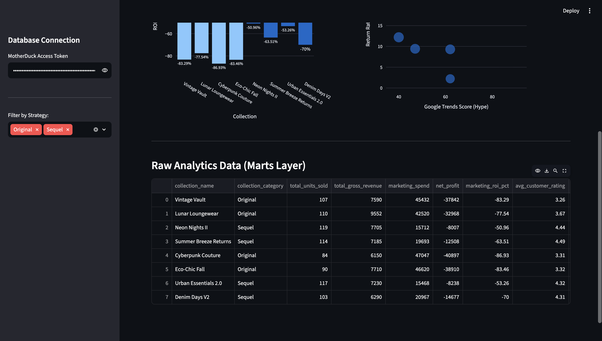

# 👗 Lou Threads: Analytics Engineering & BI Pipeline (Modern Data Stack)

## 📌 Pillar 1: The Business Problem

**Lou Threads,** a fictional mid-size fashion brand is preparing for its highly anticipated Fall season launch. The executive board is deadlocked between two competing product strategies:

1. **The Sequel Strategy:** Release "V2" of historically successful collections (e.g., "Neon Nights II", "Urban Essentials 2.0"). Safe, reliable, but potentially unexciting.
2. **The Novelty Strategy:** Launch brand-new, highly experimental collections based on current social media trends. High hype, but historically unpredictable.

**The Objective:** The executive team doesn't want to guess; they need a data-driven answer. As an **Analytics Engineer & Data Analyst**, my role was to build a full **Modern Data Stack (MDS)** pipeline. I ingested raw, siloed business files (sales, marketing spend, customer reviews, and Google Trends data), transformed them using software engineering best practices, and deployed an interactive BI dashboard to reveal the true Return on Investment (ROI) and customer satisfaction of each strategy.

---

## 🏗️ Pillar 2: Architecture & Tech Stack

This project implements a lightweight, high-performance **Modern Data Stack** entirely in the cloud and terminal.

- **Stack:**    
- **Ingestion & Storage:** `Local CSV/JSON Files`. Mocking raw operational data extracts directly loaded into the cloud.
- **Cloud Data Warehouse:** `MotherDuck` (Serverless DuckDB). Acts as the blisteringly fast, central compute engine for the analytical data.
- **Transformation Layer (Analytics Engineering):** `dbt-core` & `dbt-duckdb`. Used to enforce version control, build a clean staging layer, and execute complex SQL joins to create a business-ready data mart.
- **Business Intelligence (BI):** `Streamlit` & `Plotly`. A custom Python web application built to visualize the data and allow executives to dynamically filter the insights.

### Data Flow Diagram


### 🤝 Analytics Engineering

While I am mostly focused on backend Data Engineering (moving data continuously from point A to point B), this project highlights my **Analytics Engineering (AE)** and **Data Analyst** workflow:

1. **Taking Ownership of Logic:** Instead of just landing raw data, I applied business logic using **dbt** to ensure metrics like `Return Rate` and `Marketing ROI` are standardized and governed.
2. **Bridging the Gap:** I transformed messy raw datasets into a single source of truth (`fct_collection_performance`), ensuring the BI layer doesn't crash under the weight of heavy SQL queries.
3. **Driving the Business:** Built a dashboard that translates data into a definitive corporate strategy.

---

## 🗄️ Pillar 3: Data Model & Lineage

The pipeline utilizes **dbt** to modularize the transformations.

**1. The Sources (Raw Data)**

- `raw_sales`: Granular transaction data.
- `raw_marketing`: Ad spend across TikTok, IG, and Google.
- `raw_reviews`: Customer sentiment and return tracking.
- `raw_trends`: Google Trends hype scoring.

**2. The Staging Layer (dbt)**
Views created to cast data types, rename columns, and standardize formatting (`stg_sales`, `stg_marketing`, `stg_reviews`, `stg_trends`).

**3. The Serving Layer (`fct_collection_performance`)**
The final, materialized analytical table that powers the dashboard.
| Column | Data Type | Description |
| :--- | :--- | :--- |
| `collection_name` | VARCHAR | The specific clothing line |
| `collection_category` | VARCHAR | "Sequels" vs. "Originals" |
| `total_gross_revenue` | DECIMAL | Total revenue before marketing expenses |
| `marketing_roi_pct` | DECIMAL | True ROI factoring in ad spend |
| `avg_customer_rating` | DECIMAL | Average 1-5 star rating |
| `return_rate_pct` | DECIMAL | Percentage of orders returned by customers |
| `google_trends_score` | INTEGER | Measure of social media hype (1-100) |

---

## 🚀 Pillar 4: Setup & Execution Instructions

To reproduce this Modern Data Stack environment locally, follow these steps:

### 1. Clone the Repository & Generate Data

```bash
git clone https://github.com/praisecookie/lou-threads-analytics.git
cd lou-threads-analytics
python -m venv venv
source venv/bin/activate  # Or .\venv\Scripts\activate on Windows
pip install -r requirements.txt

# Generate the mock CSV/JSON files
python generate_data.py
```

### 2. Set up the Cloud Warehouse (MotherDuck)

Create a free account at [MotherDuck](https://app.motherduck.com/).

Create a database: `CREATE DATABASE lou_threads_db;`

Use the UI to upload the 4 files generated in the `data/` folder, naming them `raw_sales`, `raw_marketing`, `raw_reviews`, and `raw_trends`.

Grab your MotherDuck Access Token from the settings menu.

_Raw Data Ingestion:_


### 3. Run the dbt Transformation Pipeline

Configure your local `profiles.yml` (located in `~/.dbt/profiles.yml`) to point to your MotherDuck database.

```YAML
dbt_lou_threads:
  outputs:
    dev:
      type: duckdb
      path: "md:lou_threads_db?motherduck_token=YOUR_TOKEN_HERE"
      threads: 4
  target: dev
```

Execute the pipeline from your terminal to build the models in the cloud:

```bash
dbt build
```

_Successful transformation pipeline_


### 4. Launch the Streamlit Dashboard

Spin up the interactive Python web app:

```bash
streamlit run dashboard.py
```

_BI Dashboard_




**The Verdict:** The dashboard clearly reveals that while Originals drive massive social media hype and top-line revenue, their high return rates and expensive marketing costs destroy their profit margin. Sequels require significantly less ad spend, have incredibly loyal customer ratings, and yield a much higher True ROI. The Sequel Strategy wins.

---

### Author's message

Hello everyone, **Praise Cookie Lou** here 👋

You can reach out to me via [LinkedIn](https://www.linkedin.com/in/praise-cookie/) if you'd like to work on a collaborative real-world Data project simulation.

I look forward to hearing from Data Engineers, Analytics Engineers, Data Analysts, Data Scientists, Financial Analysts, etc... As long as you work with data professionally, I am open to working on real and practical collaborative projects with you.
